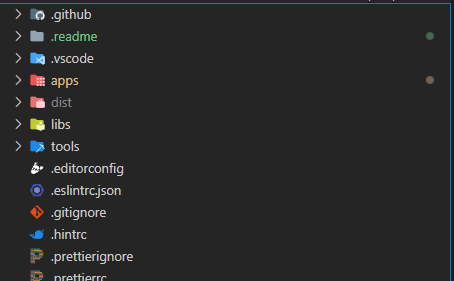
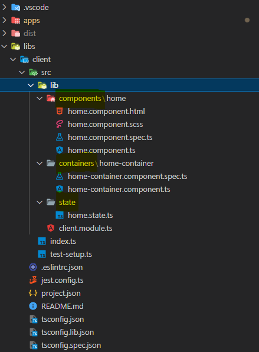
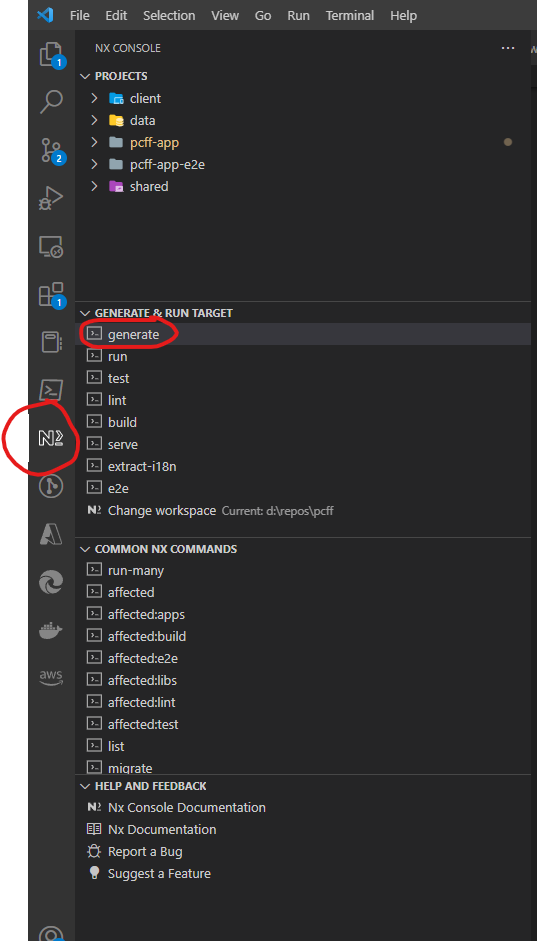
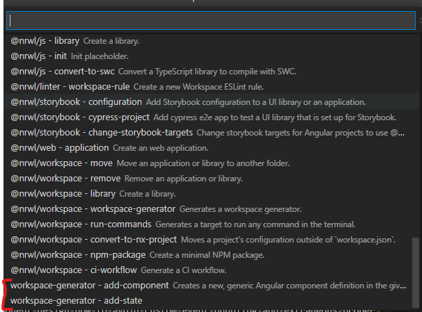

# Pcff

This project was generated using [Nx](https://nx.dev).

<p style="text-align: center;"></p>

🔎 **Smart, Fast and Extensible Build System**

## Quick Start & Documentation

[Nx Documentation](https://nx.dev/angular)

[10-minute video showing all Nx features](https://nx.dev/getting-started/intro)

[Interactive Tutorial](https://nx.dev/react-tutorial/01-create-application)

## Adding capabilities to your workspace

Nx supports many plugins which add capabilities for developing different types of applications and different tools.

These capabilities include generating applications, libraries, etc as well as the devtools to test, and build projects as well.

Below are our core plugins:

- [Angular](https://angular.io)
  - `ng add @nrwl/angular`
- [React](https://reactjs.org)
  - `ng add @nrwl/react`
- Web (no framework frontends)
  - `ng add @nrwl/web`
- [Nest](https://nestjs.com)
  - `ng add @nrwl/nest`
- [Express](https://expressjs.com)
  - `ng add @nrwl/express`
- [Node](https://nodejs.org)
  - `ng add @nrwl/node`

There are also many [community plugins](https://nx.dev/community) you could add.

## Understand your workspace

Run `nx graph` to see a diagram of the dependencies of your projects.

## Further help

Visit the [Nx Documentation](https://nx.dev/angular) to learn more.


# PCFF App - Developer Orientation

## <a name='TableofContents'></a>Table of Contents

<!-- vscode-markdown-toc -->

-   [Table of Contents](#TableofContents)
-   [Local Development Environment Setup](#LocalDevelopmentEnvironmentSetup)
    -   [Prerequisites](#Prerequisites)
    -   [Run the Application for the First Time](#RuntheApplicationfortheFirstTime)
-   [Unit Testing](#UnitTesting)
    -   [Run Unit Test](#RunUnitTest)
    -   [Run Unit Test in Watch Mode](#RunUnitTestinWatchMode)
    -   [Debug Unit Test](#DebugUnitTest)
-   [Project Folder Structure](#ProjectFolderStructure)
    -   [Root Folder](#RootFolder)
    -   [`libs` Folder](#libsFolder)
    -   [Feature Library Folder](#FeatureLibraryFolder)
-   [Generators](#generators)
    -   [Adding New Applications/Components/Libraries/Lambdas](#addApplication)
-   [Naming Convention](#NamingConvention)
    -   [File Naming Convention](#FileNamingConvention)
    -   [Coding Naming Convention](#CodingNamingConvention)
        -   [Variable and Function](#VariableandFunction)
        -   [Class](#Class)
        -   [Interface](#Interface)
        -   [Enum](#Enum)
        -   [Quotes](#Quotes)
        -   [Generics](#Generics)
-   [Source Code Repo](#SourceCodeRepo)
    -   [Branching Model](#BranchingModel)
    -   [Git Best Practice](#GitBestPractice)
    -   [Git Commit Message Guide](#GitCommitMessageGuide)
        -   [DO](#DO)
        -   [Don't](#Dont)
        -   [Sample Git Message](#SampleGitMessage)
-   [Unit Testing](#UnitTesting-1)
    -   [jest](#jest)
    -   [spectator](#spectator)
    -   [ng-mocks](#ng-mocks)
    -   [jest-marbles](#jest-marbles)

<!-- vscode-markdown-toc-config
	numbering=false
	autoSave=true
	/vscode-markdown-toc-config -->
<!-- /vscode-markdown-toc -->

## <a name='LocalDevelopmentEnvironmentSetup'></a>Local Development Environment Setup

### <a name='Prerequisites'></a>Prerequisites

1. Node.js v16 (or above)
    - [https://nodejs.org/download/release/v16.17.1/](https://nodejs.org/download/release/v16.17.1/)
2. Angular CLI v14 (or above)
3. Chrome
    - Augury extention (recommended)
    - Redux extention (recommended)
4. VS Code v1.54 (or above)
    - ESLint extention
    - Prettier extention
    - Angular Essentials extension (recommended)
    - [https://code.visualstudio.com/](https://code.visualstudio.com/)
5. NX CLI
    - Install the cli globally via `npm i -g @nrwl/cli`
    - [https://www.npmjs.com/package/@nrwl/cli](https://www.npmjs.com/package/@nrwl/cli)
6. AWS CLI
    - [https://docs.aws.amazon.com/cli/latest/userguide/getting-started-install.html](https://docs.aws.amazon.com/cli/latest/userguide/getting-started-install.html)
7. AWS SAM CLI
    - [https://docs.aws.amazon.com/serverless-application-model/latest/developerguide/serverless-sam-cli-install.html](https://docs.aws.amazon.com/serverless-application-model/latest/developerguide/serverless-sam-cli-install.html)

### <a name='RuntheApplicationfortheFirstTime'></a>Run the Application for the First Time

1. Open a command line tool
2. Create a local folder for the git repo
3. Go to creatd folder
4. `git clone <GIT_REPO_URL> .`
5. `git checkout dev`
6. `npm install`
7. `ng serve`

The project is created using Angular CLI and the local DEV server will run at http://localhost:4200 by default.

## <a name='UnitTesting'></a>Unit Testing

### <a name='RunUnitTest'></a>Run Unit Test

1. Open a command line tool
2. Go to repo folder
3. `npm test`

### <a name='RunUnitTestinWatchMode'></a>Run Unit Test in Watch Mode

1. Open a command line tool
2. Go to repo folder
3. `npm run test:watch`

### <a name='DebugUnitTest'></a>Debug Unit Test

1. Open project in VS Code
2. Go to Debug tab on the side nav
3. Set breakpoints
4. Press F5

## <a name='ProjectFolderStructure'></a>Project Folder Structure

### <a name='RootFolder'></a>`root` Folder



-   `apps` folder
    -   Contains entry point apps and lambda functions
-   `libs` folder
    -   Contains NX libraries imported by the apps
-   `dist` folder
    -   Contains the build output of the apps
-   `tools` folder
    -   Contains workspace generators and other scripts

### <a name='libsFolder'></a>`libs` Folder


-   Client Library

    -   Contains components, containers, & state used to manage the client feature module
    -   Imported once in the pcff-app AppModule

-   Shared Library

    -   Contains shared code that will be used across your app and feature modules, e.g. global pipes or global UI component.
    -   Shared Module should be used mostly in Feature Modules

#### <a name='References'></a>References

-   [Core Module vs. Shared Module](https://blog.chai-jay.com/angular-core-vs-shared-modules/)

### <a name='FeatureLibraryFolder'></a>Feature Library Folder



-   `containers` folder - Container components

    -   Subscribe to state changes from @ngxs store and provide data to Presentation Component
    -   Handle event from Presentation Component and dispatch actions to `@ngxs` store
    -   The HTML template of Container Components is composed by Presentational Components with no HTML code or dependency to 3rd party UI components

-   `components` folder - Presentation Component

    -   Define UI
    -   Get data from Container Components with `@Input`
    -   Emit event to Container Components with `@Output`

-   `actions` folder

    -   Contains `@ngxs` action creators

-   `state` folder

    -   Contains `@ngxs` state specific to the module

-   `models` folder

    -   Contains models specific to the module

-   `services` folder
    -   Contains services specific to the module
    -   Services are mostly responsible for making HTTP calls to backend
    -   Services are consumed by the state
    -   Shared services should be moved to the `shared` library

#### <a name='References'></a>References:
-   [Container vs Presentation Components Pattern](https://blog.angular-university.io/angular-component-design-how-to-avoid-custom-event-bubbling-and-extraneous-properties-in-the-local-component-tree/)

## <a name='generators'></a>Generators

The Nx workspace includes built-in and custom generators for our workspace. Generators are scripts that take inputs and scaffold our code with new components, services, state, etc.

To use a generator, you can invoke the `generate` command in the Nx console. Choose from one of the built-in generators or scroll to the bottom and pick the custom `workspace-generator` options.




### <a name='addApplication'></a>Adding New Applications/Components/Libraries/Lambdas

The Nx workspace manages all applications and their dependencies. It comes with build-in generators to scaffold the correct files and to update the necessary files.

Depending on the project type (web, api, or library) you want to add will depend on which generator you use.

-   Web applications should use the `@nrwl/angular - application` generator
-   Libraries should use the `@nrwl/angular - library` generator
-   AWS Lambdas should use the `@nrwl/node - application` or `@nrwl/nest - application` generators
-   API libraries should use the `@nrwl/node - library` or `@nrwl/nest - library` generators


## <a name='NamingConvention'></a>Naming Convention

### <a name='FileNamingConvention'></a>File Naming Convention

| Type                                    | Convention                        | Class Name            |
| --------------------------------------- | --------------------------------- | ----------------      |
| Angular Module                          | .module.ts                        | \*Module              |
| Angular Routing Module                  | `<module-name>`-routing.ts        | \*RoutingModule       |
| Presentation Component                  | \*.component.ts                   | \*component           |
| Container Component                     | \*-container.component.ts         | \*ContainerComponent  |
| Container Component (Modal)             | \*-modal.component.ts             | \*ModalComponent      |
| Directive                               | \*.directive.ts                   | \*Directive           |
| Pipe                                    | \*.pipe.ts                        | \*Pipe                |
| Action/Action Creator                   | \*.action.ts                      | N/A                   |
| State                                   | \*.state  .ts                     | \*State               |
| Service                                 | \*.service.ts                     | \*Service             |
| Unit Test                               | `<target-file-name>`.spec.ts      | N/A                   |


### <a name='CodingNamingConvention'></a>Coding Naming Convention

#### <a name='VariableandFunction'></a>Variable and Function

| Type                       | Naming Standard                          | Sample                             |
| -------------------------- | ---------------------------------------- | ---------------------------------- |
| Variable                   | Camel case                               | `fooVar: string;`                  |
| Function                   | Camel case                               | `fooFunction() {}`                 |
| Constant variable          | Camel case                               | `const weeksInYear = 52;`          |
| Exported constant variable | Upper case                               | `export const DAYS_IN_YEAR = 365;` |
| Observable variable        | Add "$" suffix to Observable<T> variable | `isPending$: Observable<boolean>;` |

For example,

```typescript
fooVar: string;

fooFunction() {}

const weeksInAYear = 52;

export const DAYS_IN_YEAR = 365;

export const logout = 'Logout';

isPending$: Observable<boolean> = this.store.select(HomeState.isLoginPending());
```

#### <a name='Class'></a>Class

The only reasons to use a class is to check if a variable is of that instance using the `instanceof` operator, or to create injectable Angular components/services. It's encouraged that you avoid classes unless necessary and instead export your functions. This will allow webpack to perform any tree-shaking to remove unused code. It's also a good practice for modular design patterns.

| Type                             | Naming Standard                      | Sample                          |
| -------------------------------- | ------------------------------------ | ------------------------------- |
| Class Name                       | Pascal case                          | `class Foo {} `                 |
| Abstract Class Name              | Prefix "Abstract" to class name      | `abstract class AbstractFoo {}` |
| Public class variable            | Camel case                           | `public fooVar: string;`        |
| Private/Protected class variable | Add leading underscore to camel case | `private _barVar: string;`      |
| Public class function            | Camel case                           | `public fooFunction() {}`       |
| Private/Protected class function | Add leading underscore to camel case | `private _barFunction() {}`     |

For example,

```typescript
class Foo {
    fooVar: string;

    private _barVar: string;

    fooFunction() {}

    protected _protectedFunction() {}

    private _barFunction() {}
}

abstract class AbstractFoo {
    // ...
}
```

#### <a name='Interface'></a>Interface

| Type               | Naming Standard | Sample             |
| ------------------ | --------------- | ------------------ |
| Interface Name     | Pascal case     | `interface Foo {}` |
| Interface variable | Camel case      | `fooVar: string;`  |
| Interface function | Camel case      | `fooFunction() {}` |

For example,

```typescript
interface Foo {
    fooVar: string;
    barFunction();
}
```

#### <a name='Enum'></a>Enum

| Type        | Naming Standard | Sample        |
| ----------- | --------------- | ------------- |
| Enum Name   | Pascal case     | enum Color {} |
| Enum member | Pascal case     | Red           |

For example,

```typescript

enum Color {
    Red;
    Blue;
    Green;
}

```

#### <a name='Quotes'></a>Quotes

-   Use single quote (') unless escaping

For example,

```typescript
let name = 'John Doe';
```

#### <a name='Generics'></a>Generics

-   Generic type must start with "T"

For example,

```typescript
function identity<TPerson>(arg: TPerson): TPerson {
    return arg;
}
```

## <a name='SourceCodeRepo'></a>Source Code Repo

### <a name='BranchingModel'></a>Branching Model


We will adopt `Development Isolation` branching model at the beginning.

-   All team members will use the `dev` branch during sprint.
-   Code will be merged to the `master` branch for PROD release only.

As the team matures or the need to support more complex release planning arise, other branching models (e.g. `feature isolation`, `release isolation`) will be considered.

#### <a name='References-1'></a>References

-   [Branching Model Strategies with TFVC](https://docs.microsoft.com/en-us/azure/devops/repos/tfvc/branching-strategies-with-tfvc?view=azure-devops)

### <a name='GitBestPractice'></a>Git Best Practice

-   Commit Related Changes
-   Commit Often
-   Don't commit half-done work
-   Test code before commit
-   Write good commit message
-   Fix failed commit ASAP

### <a name='GitCommitMessageGuide'></a>Git Commit Message Guide

#### <a name='DO'></a>DO

-   Use the imperative mood in the subject line. That is as if you were commanding someone. Start the line with “Fix”, “Add”, “Change” instead of “Fixed”, “Adding”, “Changes”.
-   Limit the subject line to 50 characters
-   Capitalize the subject line
-   Separate subject from body with a blank line
-   Wrap the body at 72 characters
-   Use the body to explain what and why vs. how

#### <a name='Dont'></a>Don't

-   Don’t end the summary line with a period

#### <a name='SampleGitMessage'></a>Sample Git Message

    Short summary of changes (50 chars or less)

    More detailed explanatory text, if necessary. Wrap it to about 72
    characters or so. In some contexts, the first line is treated as the
    subject of an email and the rest of the text as the body. The blank
    line separating the summary from the body is critical (unless you omit
    the body entirely); tools like rebase can get confused if you run the
    two together.

    Further paragraphs come after blank lines.

    -   Bullet points are okay, too

    -   Typically a hyphen or asterisk is used for the bullet, preceded by a
        single space, with blank lines in between, but conventions vary here

## <a name='UnitTesting-1'></a>Unit Testing

The target unit test coverage of this project is `80%`.

This section lists the major testing frameworks/libraries used by the project.

### <a name='jest'></a>jest

[`jest`](https://jestjs.io/docs/getting-started) is a testing framework created by Facebook, which continually gains steam. As compared with the out-of-box `karma` + `jasmine` testing frameworks for Angular project, `jest` comes with the following main benefits:

-   `jest` is way faster than `karma`. One of the reasons for that is because `jest` doesn’t start a browser. Instead, it uses a virtual dom called `jsdom`.
-   `jest` contains improved test reports. The reports are much more readable and more comfortable to grasp.
-   Integrated coverage out of the box — no more need for `instanbul`.
-   Excellent command-line interface with a lot of advanced options. Run only one test, run tests according to a regex pattern or run only failed tests.

### <a name='spectator'></a>spectator

[`spectator`](https://github.com/ngneat/spectator#readme) is a unit testing library designed for Angular to remove boilerplate codes for unit testing.

Here's a quick comparison.

-   Testing with Angular TestBed

    ```typescript
    import { async, ComponentFixture, TestBed } from '@angular/core/testing';
    import { CommonBannerComponent } from './common-banner.component';

    describe('CommonBannerComponent', () => {
        let component: CommonBannerComponent;
        let fixture: ComponentFixture<CommonBannerComponent>;

        beforeEach(async(() => {
            void TestBed.configureTestingModule({
                declarations: [CommonBannerComponent],
            }).compileComponents();
        }));

        beforeEach(() => {
            fixture = TestBed.createComponent(CommonBannerComponent);
            component = fixture.componentInstance;
        });

        it('should compile', () => {
            expect(component).toBeTruthy();
        });
    });
    ```

-   Testing with Spectator

    ```typescript
    import { Spectator, createComponentFactory } from '@ngneat/spectator/jest';
    import { CommonBannerComponent } from './common-banner.component';

    describe('CommonBannerComponent', () => {
        let spectator: Spectator<CommonBannerComponent>;
        const createComponent = createComponentFactory({
            component: CommonBannerComponent,
        });

        beforeEach(() => (spectator = createComponent()));

        it('should compile', () => {
            expect(spectator.component).toBeTruthy();
        });
    });
    ```

### <a name='ng-mocks'></a>ng-mocks

[`ng-mocks`](https://ng-mocks.sudo.eu) is used to mock components, modules, directives, pipes, services, etc. in Angular.

> For mocking regular functions, use `jest.fn()`.

> When mocking dependent modules, one exception is the `RouterModule`, where `RouterTestingModule` provides better support for unit testing.

For example,

```typescript
// imports ...

describe('TranscriptOrderDetailComponent', () => {
    let spectator: Spectator<TranscriptOrderDetailComponent>;
    const createComponent = createComponentFactory({
        component: TranscriptOrderDetailComponent,
        declarations: [
            MockComponent(TranscriptOrderDetailHeaderComponent),
            MockComponent(OrderDetailsComponent),
            MockComponent(HearingDetailsComponent),
            MockComponent(TranscriptDetailsComponent),
            MockComponent(MessagesComponent),
            MockComponent(MessageTmsComponent),
        ],
        imports: [
            RouterTestingModule,
            MockModule(FlexLayoutModule),
            MockModule(AngularComponentsModule),
        ],
        mocks: [Router],
    });

    beforeEach(() => (spectator = createComponent()));

    it('should compile', () => {
        expect(spectator.component).toBeTruthy();
    });

    // ...
}
```

### <a name='jest-marbles'></a>jest-marbles

[`jest-marbles`](https://github.com/just-jeb/jest-marbles#readme) is a set of helper functions and Jest matchers for [RxJs marble testing](https://rxjs-dev.firebaseapp.com/guide/testing/internal-marble-tests).

-   imports

        import {cold, hot, time} from 'jest-marbles';

-   matchers

        expect(stream).toBeObservable(expected);
        expect(stream).toBeMarble(marbleString);
        expect(stream).toHaveSubscriptions(marbleString);
        expect(stream).toHaveSubscriptions(marbleStringsArray);
        expect(stream).toHaveNoSubscriptions();
        expect(stream).toSatisfyOnFlush(() => {
            expect(someMock).toHaveBeenCalled();
        })
